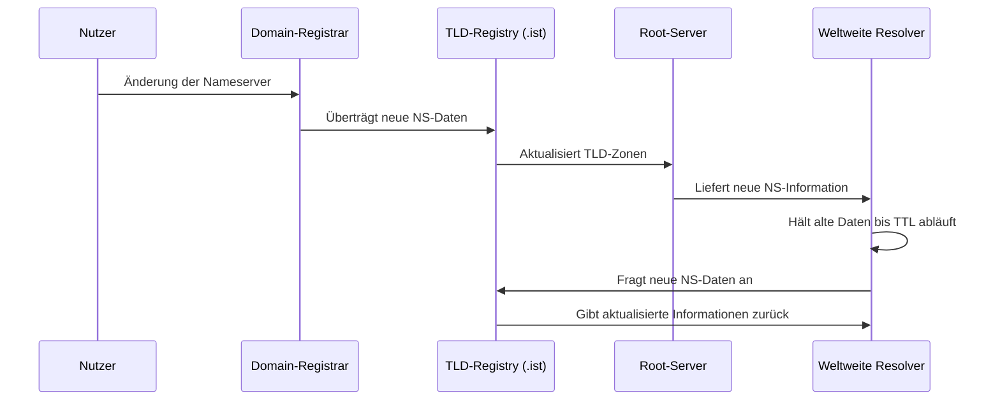

# 🌐 DNS-Propagation und TTL

> Autor: Wang  
> Thema: Computernetzwerke – Domain Name System (DNS)  
> Datum: 10.11.2025

---

## 🧭 1. Was bedeutet DNS-Propagation?

**DNS-Propagation** bezeichnet den Zeitraum, in dem sich geänderte DNS-Informationen  
(z. B. neue Nameserver, A-Records, MX-Records usw.) über das gesamte Internet verbreiten.

Das Domain Name System ist **dezentral aufgebaut** – es gibt Tausende von DNS-Servern weltweit.  
Wenn du also eine Änderung an deiner Domain vornimmst, muss diese Aktualisierung Schritt für Schritt  
von Server zu Server weitergegeben werden.

> 🕓 Während dieser Zeit kann es vorkommen, dass einige Benutzer bereits die neue Version  
> deiner Website sehen, während andere noch die alte Adresse aufrufen.

---

## 🧩 2. Aufbau des DNS-Systems (Wiederholung)

| Ebene                       | Beispiel              | Aufgabe                                     |
| --------------------------- | --------------------- | ------------------------------------------- |
| 🌐 Root-Nameserver          | `.`                   | Kennt alle Top-Level-Domains                |
| 🏷️ TLD-Nameserver           | `.com`, `.de`, `.ist` | Zuständig für die jeweilige Domain-Endung   |
| 📡 Autoritativer Nameserver | `ns1.27p.net`         | Enthält die DNS-Zonendateien einer Domain   |
| 💻 Rekursiver Resolver      | `8.8.8.8`, `1.1.1.1`  | Fragt alle Ebenen im Auftrag des Clients ab |

---

## 🔄 3. Ablauf einer DNS-Änderung

Wenn du z. B. bei deinem Domain-Registrar die Nameserver von `domaincontrol.com`  
auf `ns1.27p.net` änderst, passiert Folgendes:

1. **Registrar aktualisiert die Domain-Daten**  
   → Übermittelt die neuen Nameserver an die Registry der TLD `.ist`.

2. **Registry (TLD-Verwaltung) aktualisiert ihre Zonen-Datei**  
   → Jetzt steht dort:  
   `wang.ist → ns1.27p.net, ns2.27p.net, ns3.27p.net, ns4.27p.net`

3. **Lokale DNS-Resolver weltweit haben noch alte Einträge im Cache**  
   → Sie glauben noch für einige Stunden, dass `wang.ist` über die alten Nameserver läuft.

4. **Nach Ablauf der TTL aktualisieren die Resolver ihre Daten**  
   → Sie holen sich die neuen Informationen und speichern sie erneut zwischen.

---

## ⏱️ 4. Was ist TTL (Time To Live)?

Jeder DNS-Eintrag besitzt einen **TTL-Wert**, der angibt,  
wie lange eine Information im Cache eines DNS-Servers gültig bleibt.

Beispiel:
A-Record: wang.ist → 185.151.30.188
TTL: 86400 Sekunden (24 Stunden)

Das bedeutet:

> Der Resolver speichert diese Zuordnung 24 Stunden lang  
> und fragt erst danach wieder beim autoritativen Server nach.

Je **kürzer** die TTL, desto **schneller** werden Änderungen übernommen –  
aber desto **höher** ist auch die DNS-Last, da häufiger neue Abfragen stattfinden.

---

## 📈 5. Ablaufdiagramm (DNS-Propagation)



---

## 🌍 6. Dauer der DNS-Propagation

| Region                  | Durchschnittliche Dauer    |
| ----------------------- | -------------------------- |
| 🇩🇪 Europa               | 1–3 Stunden                |
| 🇺🇸 Nordamerika          | 3–12 Stunden               |
| 🌏 Asien                | 6–24 Stunden               |
| 🌐 Weltweit vollständig | Bis zu 48 Stunden (selten) |

Die Dauer hängt vor allem von der TTL und den Caching-Mechanismen der Provider ab.

---

## 🔍 7. Überprüfung des Fortschritts

**🔸 Mit der Kommandozeile:**

```
nslookup -type=ns wang.ist
nslookup -type=a wang.ist
```

**🔸 Online-Tools:**

https://www.whatsmydns.net/

https://dnschecker.org/

Diese Tools zeigen, welche DNS-Server weltweit bereits auf die neuen Daten umgestellt haben.

## 🧠 8. Zusammenfassung

| Begriff                   | Bedeutung                                                    |
| ------------------------- | ------------------------------------------------------------ |
| **DNS-Propagation**       | Prozess der weltweiten Synchronisierung von DNS-Daten        |
| **TTL (Time To Live)**    | Zeitspanne, in der DNS-Daten im Cache bleiben                |
| **Grund für Verzögerung** | Caching auf verschiedenen DNS-Ebenen                         |
| **Lösung**                | Warten, bis TTL abläuft oder Cache manuell leeren            |
| **Ergebnis**              | Nach Abschluss kennt das gesamte Internet die neuen Einträge |
