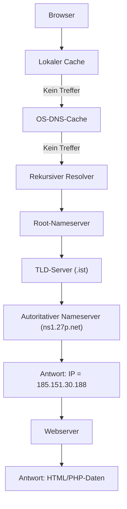

# 🌐 Funktionsweise des DNS-Systems

> Autor: Mengyu Wang  
> Thema: Computernetzwerke – Namensauflösung  
> Datum: 10.11.2025

---

## 🧭 1. Was ist das Domain Name System (DNS)?

Das **Domain Name System (DNS)** ist das „Telefonbuch des Internets“.  
Es übersetzt menschenlesbare Domainnamen (z. B. `wang.ist`) in IP-Adressen  
(z. B. `185.151.30.188`), die von Computern verstanden werden.

**Analogie:**

> DNS = ein globales Nachschlagewerk, das jedem Namen eine Adresse zuordnet.

---

## 🧩 2. Hierarchische Struktur des DNS

| Ebene                       | Beispiel              | Aufgabe                                           |
| --------------------------- | --------------------- | ------------------------------------------------- |
| 🌐 Wurzel-Nameserver (Root) | `.`                   | Kennt alle Top-Level-Domains                      |
| 🏷️ TLD-Nameserver           | `.de`, `.com`, `.ist` | Zuständig für eine Domain-Endung                  |
| 📡 Autoritativer Nameserver | `ns1.27p.net`         | Enthält die Zonen-Datei für eine bestimmte Domain |
| 💻 Rekursiver Resolver      | `8.8.8.8`, `1.1.1.1`  | Fragt im Auftrag des Clients alle Ebenen ab       |

---

## 🔍 3. Ablauf einer DNS-Abfrage (Beispiel: `https://wang.ist`)

1. **Browser-Cache prüfen**  
   Wenn der Browser die IP bereits kennt, nutzt er sie sofort.

2. **Betriebssystem-Cache prüfen**  
   Falls der Browser nichts findet, fragt er das Betriebssystem.

3. **Anfrage an den rekursiven Resolver**  
   (z. B. den DNS-Server deines Internet-Providers oder `8.8.8.8` von Google)

4. **Root-Server**  
   → Antwort: „Für `.ist` ist der TLD-Server `a0.nic.ist` zuständig.“

5. **TLD-Server**  
   → Antwort: „Für `wang.ist` sind die autoritativen Nameserver  
   `ns1.27p.net`, `ns2.27p.net`, `ns3.27p.net`, `ns4.27p.net` zuständig.“

6. **Autoritativer Nameserver**  
   → Antwort: „`wang.ist` hat die IP-Adresse `185.151.30.188`.“

7. **Resolver speichert Ergebnis**  
   und gibt die IP an den Browser zurück (Caching für einige Stunden).

8. **Browser baut Verbindung zum Webserver auf**  
   → TCP-Handshake  
   → ggf. SSL/TLS-Handshake  
   → HTTP-Anfrage: `GET /index.html`

9. **Webserver liefert HTML oder PHP zurück**,  
   das vom Browser gerendert wird.

---

## 📈 4. Ablaufdiagramm (Mermaid)

