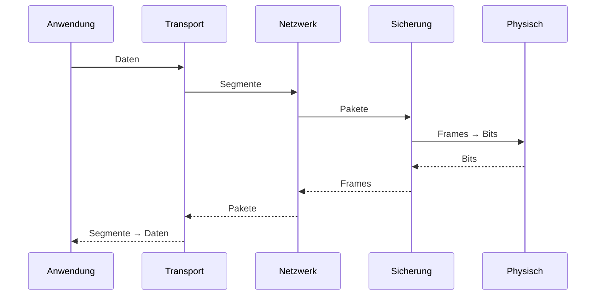

# 🧩 OSI-Referenzmodell – Grundlagen und Funktionsweise

## 1️⃣ Einführung

Das **OSI-Referenzmodell (Open Systems Interconnection)** ist ein internationaler Standard, der die Netzwerkkommunikation in **sieben klar definierte Schichten** unterteilt.  
Es dient als theoretisches Modell, um Netzwerktechnik zu strukturieren, Protokolle einzuordnen und Fehler systematisch zu analysieren.

---

## 2️⃣ Übersicht der sieben Schichten

| Nr. | Schichtname                | Hauptaufgaben                                      |
|----|-----------------------------|----------------------------------------------------|
| 7  | Anwendungsschicht           | Benutzerdienste, Netzwerk-Anwendungen             |
| 6  | Darstellungsschicht         | Kodierung, Kompression, Verschlüsselung           |
| 5  | Sitzungsschicht             | Aufbau, Steuerung und Beendigung von Sitzungen    |
| 4  | Transportschicht            | Zuverlässige oder schnelle Ende-zu-Ende-Übertragung |
| 3  | Vermittlungsschicht         | Routing, IP-Adressierung                           |
| 2  | Sicherungsschicht           | Frames, MAC, Fehlererkennung                       |
| 1  | Bitübertragungsschicht      | Physische Signalübertragung                        |

---

## 3️⃣ Schichten im Detail

### **7. Anwendungsschicht (Application Layer)**
- Schnittstelle zwischen Benutzer/Software und dem Netzwerk  
- Typische Protokolle: **HTTP, HTTPS, FTP, SMTP, DNS**

---

### **6. Darstellungsschicht (Presentation Layer)**
- Datenformatierung und -umwandlung  
- Zeichencodierung (z. B. UTF‑8)  
- Kompression  
- Verschlüsselung (z. B. Bestandteil von TLS/SSL)

---

### **5. Sitzungsschicht (Session Layer)**
- Aufbau, Verwaltung und Beendigung von Sitzungen  
- Dialogsteuerung  
- Checkpoints / Synchronisation bei längeren Datenströmen

---

### **4. Transportschicht (Transport Layer)**
- Ende‑zu‑Ende-Kommunikation  
- Segmentierung / Reassemblierung  
- Fehlerkontrolle  
- Protokolle:  
  - **TCP** – zuverlässig, verbindungsorientiert  
  - **UDP** – schnell, verbindungslos  

---

### **3. Vermittlungsschicht (Network Layer)**
- Routing von Paketen über mehrere Netzwerke hinweg  
- Logische Adressierung (**IPv4 / IPv6**)  
- Protokolle: **IP, ICMP, ARP**  
- Typische Geräte: **Router**

---

### **2. Sicherungsschicht (Data Link Layer)**
- Organisation der Daten in Frames  
- MAC-Adressen  
- Fehlererkennung (CRC)  
- Kollisionsvermeidung  
- Geräte: **Switches, Bridges**  
- Standards: **Ethernet (802.3), WLAN (802.11)**

---

### **1. Bitübertragungsschicht (Physical Layer)**
- Übertragung einzelner Bits als elektrische/optische Signale  
- Kabel, Stecker, Funktechnik  
- Spezifikationen für Spannung, Frequenz, Modulation

---

## 4️⃣ Encapsulation & Decapsulation – Ablauf der Datenübertragung

---

## 5️⃣ Vergleich: OSI vs. TCP/IP-Modell

| OSI-Schicht             | Entsprechung im TCP/IP-Modell |
|-------------------------|-------------------------------|
| 7 Anwendung             | Anwendung                     |
| 6 Darstellung           | Anwendung                     |
| 5 Sitzung               | Anwendung                     |
| 4 Transport             | Transport                     |
| 3 Vermittlung           | Internet                      |
| 2 Sicherung             | Netzwerkschicht               |
| 1 Bitübertragung        | Netzwerkschicht               |

---

## 6️⃣ Typische Fehlerquellen & Verwechslungen

### 🔸 **Switch vs. Router**
- Switch: arbeitet auf **Layer 2 (MAC)**  
- Router: arbeitet auf **Layer 3 (IP)**

### 🔸 **IP vs. MAC**
- MAC: Hardware-Adresse, lokal eindeutig  
- IP: logische Adresse, routbar

### 🔸 **TCP vs. UDP**
- TCP: ordnet Pakete korrekt zu, sicher  
- UDP: keine Garantie, aber schnell

---

## 7️⃣ Zusammenfassung

Das OSI-Modell bietet eine strukturierte Sicht auf Netzwerkkommunikation.  
Es dient vor allem zur:

- Einordnung von Protokollen  
- Fehleranalyse  
- Trennung von Verantwortlichkeiten  
- Standardisierung von Technologien

