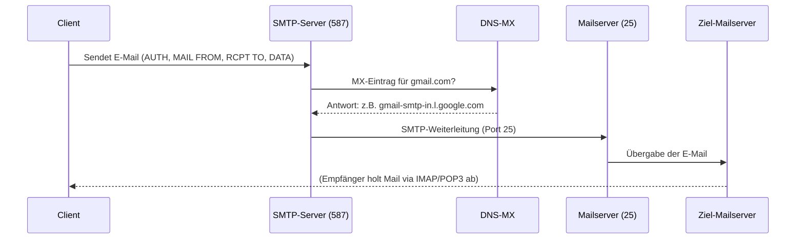

# 📬 SMTP – Grundlagen und Funktionsweise  
> Autor: Mengyu Wang  
> Thema: Computernetzwerke – E-Mail-Übertragung  
> Datum: 06.12.2025

---

## 🧭 1. Was ist SMTP?

**SMTP (Simple Mail Transfer Protocol)** ist ein **Anwendungsprotokoll**, das für das **Senden von E-Mails** zuständig ist.  
Es wird verwendet für:

- ✉ **Client → Mailserver** (Mail Submission)
- ✉ **Mailserver → Mailserver** (Weiterleitung im Internet)

⚠ **SMTP empfängt keine E-Mails für Endnutzer.**  
Zum Abrufen werden **POP3** oder **IMAP** verwendet.

**Merksatz:**  
> SMTP = „E-Mails *verschicken*“.  
> POP3/IMAP = „E-Mails *empfangen*“.

---

## 🔌 2. SMTP-Ports und Verschlüsselung

| Zweck | Port (unverschlüsselt) | Port (verschlüsselt) | Erklärung |
|------|-------------------------|------------------------|-----------|
| 📤 Server-zu-Server Versand | TCP **25** | TCP 25 + STARTTLS | Standard für Mailserver |
| 📥 Mail Submission (Client → Server) | — | TCP **587** | Moderner Standard, STARTTLS |
| 📥 Legacy SMTPS | — | TCP **465** | Direkter TLS-Kanal |

**Empfehlung heute:**  
- **Port 587 mit STARTTLS** für Clients  
- **Port 25** bleibt für Server-Transport bestehen (oft durch Provider blockiert)

---

## 📦 3. SMTP-Ablauf: Wie wird eine E-Mail versendet?

### Beispiel: `alice@example.com` → `bob@gmail.com`

1. **Nutzer schreibt E-Mail** im Client (Outlook, Apple Mail, Webmail, App)
2. **Client sendet Mail an SMTP-Server** (Submission Port 587)
3. **Server prüft Absenderauthentifizierung** (Login, Passwort, ggf. OAuth)
4. **Domain-Lookup (DNS MX-Record)** für `gmail.com`
5. **SMTP-Verbindung zwischen Servern (Port 25)**  
6. **Ziel-Mailserver akzeptiert Mail und speichert sie im Postfach**
7. **Empfänger ruft Mail über POP3/IMAP ab**

---

## 📡 4. SMTP-Befehle (Beispiele)

| Befehl | Bedeutung |
|--------|-----------|
| **HELO / EHLO** | Vorstellung des Clients |
| **MAIL FROM:** | Absenderadresse |
| **RCPT TO:** | Empfängeradresse |
| **DATA** | Beginn der Nachrichteninhalte |
| **QUIT** | Beenden der Sitzung |

**Typischer Ablauf:**

```text
EHLO client.example.com
MAIL FROM:<alice@example.com>
RCPT TO:<bob@gmail.com>
DATA
Subject: Hallo Bob
Dies ist eine Testmail.
.
QUIT
```

---

## 🔐 5. SMTP-Verschlüsselung: STARTTLS vs. SMTPS

### 🛡 STARTTLS (empfohlen)
- Start mit **normaler SMTP-Verbindung**
- Danach **Upgrade auf TLS**
- Flexibel und moderner Standard für Port **587**

### 🔒 SMTPS (Port 465)
- Verbindung beginnt direkt mit TLS
- Weniger flexibel, aber weiterhin verbreitet

**Beide schützen:**
- Login-Daten  
- Übertragene E-Mail-Inhalte

---

## 🧾 6. E-Mail-Authentifizierung: SPF, DKIM und DMARC

Moderne Mailserver prüfen drei Mechanismen, um Spam und Spoofing zu verhindern:

| Mechanismus | Bedeutung |
|-------------|-----------|
| **SPF** | Prüft: Darf die IP im Namen der Domain E-Mails senden? |
| **DKIM** | Digitale Signatur im Header → schützt vor Manipulation |
| **DMARC** | Richtlinie: Was tun, wenn SPF/DKIM fehlschlagen? |

**Merksatz:**  
> SPF = *Wer* darf senden?  
> DKIM = *Ist die Mail echt?*  
> DMARC = *Was passiert bei Fehlern?*

---

## 📩 7. Unterschied: SMTP vs. POP3 vs. IMAP

| Protokoll | Aufgabe | Verwendung |
|-----------|----------|-------------|
| **SMTP** | E-Mails senden | Client → Server / Server → Server |
| **POP3** | E-Mails herunterladen | Lokale Speicherung |
| **IMAP** | E-Mails synchronisieren | Moderne Mailclients, Server bleibt „Master“ |

---

## 🚫 8. Warum blockieren viele Provider den Port 25?

- Häufiger Missbrauch für **Spam**  
- Sicherheitspolitik vieler ISPs  
- Eigene Mailserver zu betreiben wird dadurch erschwert (Reverse DNS, Blacklists, Reputation etc.)

---

## 🔄 9. SMTP-Übertragungsfluss (Mermaid-Diagramm)



---

## 📝 10. Kurze Zusammenfassung

- SMTP ist das **Standardprotokoll zum Versenden von E-Mails**.  
- Hauptports: **25**, **587**, **465**.  
- Moderne Sicherheit: **TLS + SPF + DKIM + DMARC**.  
- SMTP sendet → POP3/IMAP empfangen.  
- Mail-Routing erfolgt über **DNS MX-Records**.  

> Kurz: Ohne SMTP würden E-Mails im Internet nicht von Absender- zu Empfänger-Mailserver transportiert werden können.
