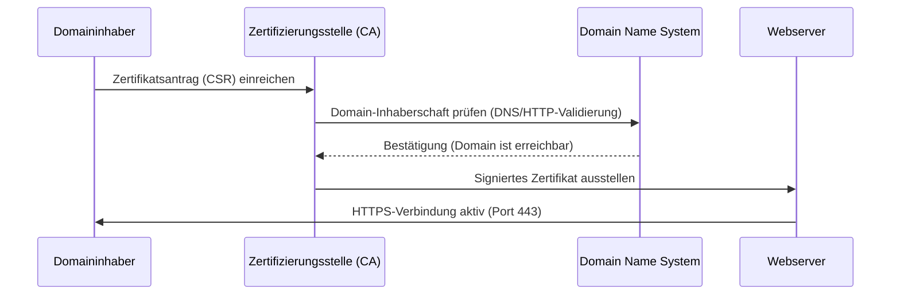
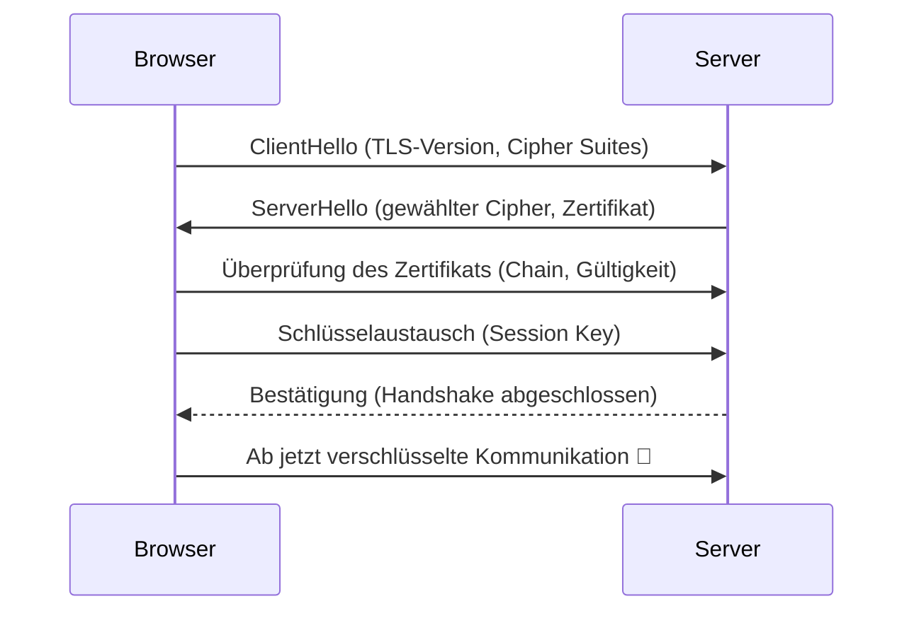

# 🔐 SSL/TLS-Zertifikate – Prinzip und Ausstellungsvorgang

## 1️⃣ Ziel und Funktion

SSL/TLS-Zertifikate dienen dazu, die Kommunikation zwischen Client (z. B. Browser) und Server zu sichern.  
Sie gewährleisten drei Hauptfunktionen:

| Funktion                | Beschreibung                                                                               |
| ----------------------- | ------------------------------------------------------------------------------------------ |
| 🔒 **Verschlüsselung**  | Alle Daten werden verschlüsselt übertragen, sodass Dritte sie nicht mitlesen können.       |
| 🪪 **Authentifizierung** | Das Zertifikat beweist, dass die Website tatsächlich dem angegebenen Domaininhaber gehört. |
| ✅ **Integrität**       | Es wird sichergestellt, dass die übertragenen Daten unterwegs nicht verändert werden.      |

---

## 2️⃣ Grundprinzip des SSL/TLS-Systems

### 🔸 Asymmetrische Kryptographie

SSL/TLS basiert auf einem Schlüsselpaar:

- **Privater Schlüssel (Private Key)**: wird geheim auf dem Server gespeichert.
- **Öffentlicher Schlüssel (Public Key)**: wird im Zertifikat veröffentlicht.

Der Browser verwendet den öffentlichen Schlüssel, um eine sichere Verbindung aufzubauen.  
Nur der Server kann die Nachrichten mit seinem privaten Schlüssel entschlüsseln.

---

## 3️⃣ Rollen im Zertifikatssystem

| Rolle                                                     | Beschreibung                                                                                                                       |
| --------------------------------------------------------- | ---------------------------------------------------------------------------------------------------------------------------------- |
| 🧑‍💻 **Domaininhaber (Website-Betreiber)**                  | Beantragt ein Zertifikat für seine Domain.                                                                                         |
| 🏢 **Zertifizierungsstelle (CA – Certificate Authority)** | Überprüft den Antragsteller und signiert das Zertifikat.                                                                           |
| 🌐 **Root-CA und Intermediate-CA**                        | Hierarchisches Vertrauenssystem – der Browser vertraut der Root-CA, die wiederum die Zwischenzertifikate (Intermediate) validiert. |

---

## 4️⃣ Ablauf der Zertifikatsausstellung (z. B. Let’s Encrypt)

---

## 5️⃣ Gängige Validierungsmethoden

| Typ                              | Beschreibung                                                                         | Beispiel                   |
| -------------------------------- | ------------------------------------------------------------------------------------ | -------------------------- |
| **DV (Domain Validation)**       | Überprüfung, dass Antragsteller Kontrolle über die Domain hat (DNS oder HTTP-Datei). | `Let's Encrypt`, `Sectigo` |
| **OV (Organisation Validation)** | Zusätzlich Prüfung der Organisation, Handelsregister etc.                            | Für Firmen-Webseiten       |
| **EV (Extended Validation)**     | Umfassende rechtliche Prüfung, zeigt den Firmennamen in der Adresszeile.             | Banken, Versicherungen     |

> 🔹 Let’s Encrypt nutzt **DV**, da sie vollautomatisiert und kostenlos ist.

---

## 6️⃣ Technischer Ablauf beim Verbindungsaufbau (Handshake)

---

## 7️⃣ Zertifikatsdateien auf dem Server

| Datei             | Inhalt                                    | Beispiel                             |
| ----------------- | ----------------------------------------- | ------------------------------------ |
| `private.key`     | Privater Schlüssel (geheim!)              | Wird nie geteilt                     |
| `certificate.crt` | Öffentliches Zertifikat (signiert von CA) | Enthält Public Key                   |
| `ca-bundle.crt`   | Zertifikatskette (Intermediate + Root)    | Vom Browser zur Verifikation genutzt |

---

## 8️⃣ Automatische Ausstellung bei Hosting-Anbietern

Viele Hosting-Plattformen (z. B. `clientcp.net`, `stackcp.net`, `IONOS`, `Namecheap`)  
nutzen ein automatisiertes System, um SSL-Zertifikate für Domains auszustellen:

1. Domain verwendet **Hosting-eigene Nameserver**
2. System erkennt Domain und generiert automatisch eine **CSR (Certificate Signing Request)**
3. CA (meist Let’s Encrypt oder Sectigo) prüft per **DNS/HTTP Challenge**, ob die Domain erreichbar ist
4. Zertifikat wird automatisch installiert
5. Das System erneuert das Zertifikat alle **90 Tage** automatisch

---

## 9️⃣ Mögliche Fehlerquellen

| Fehler                                     | Ursache                                                      | Lösung                                                                |
| ------------------------------------------ | ------------------------------------------------------------ | --------------------------------------------------------------------- |
| 🔴 „Certificate not valid for domain name“ | Zertifikat gehört zu anderer Domain (z. B. `stackcp.com`)    | SSL neu aktivieren oder warten, bis neues Zertifikat ausgestellt wird |
| ⚠️ „Ungesicherte Verbindung“               | HTTP statt HTTPS / Browser nutzt alte Cache-Version          | Browser-Cache löschen, „Force HTTPS“ aktivieren                       |
| 🕒 „SSL aktiv, aber kein grüner Schloss“   | DNS-Propagation oder CA-Validierung noch nicht abgeschlossen | Bis zu 12 Stunden warten                                              |
| 🧱 „ERR_CERT_AUTHORITY_INVALID“            | Selbstsigniertes Zertifikat oder CA nicht vertrauenswürdig   | Nur vertrauenswürdige CA (z. B. Let’s Encrypt) verwenden              |

---

## 🔟 Zusammenfassung

| Phase               | Beschreibung                                                   |
| ------------------- | -------------------------------------------------------------- |
| 🏗️ **Antrag**       | Webserver oder Hosting-Anbieter erstellt CSR                   |
| 🔍 **Validierung**  | CA prüft Domainbesitz (z. B. DNS TXT oder HTTP Challenge)      |
| 🪪 **Signatur**      | CA signiert das Zertifikat mit ihrem privaten Schlüssel        |
| 🚀 **Installation** | Zertifikat wird auf dem Server installiert und HTTPS aktiviert |
| ♻️ **Erneuerung**   | Automatisch alle 60–90 Tage neu ausgestellt                    |

---

## 📘 Hinweis

Kostenlose SSL-Zertifikate (z. B. Let’s Encrypt) sind technisch **gleich sicher** wie kostenpflichtige,  
der Unterschied liegt nur in der Art der Validierung und im Supportumfang.

