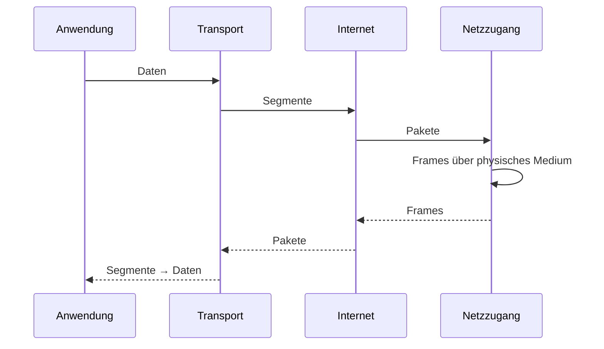

# 🌐 TCP/IP-Modell – Grundlagen und Funktionsweise

## 1️⃣ Einführung

Das **TCP/IP-Modell (Transmission Control Protocol / Internet Protocol)** ist das praktische, real implementierte Protokollmodell des Internets.  
Es beschreibt, wie Daten in einem Netzwerk übertragen, geroutet und verarbeitet werden.  
Im Gegensatz zum theoretischen **OSI-Referenzmodell** besteht das TCP/IP-Modell aus **vier funktionsorientierten Schichten**.

---

## 2️⃣ Übersicht der vier Schichten

| Nr. | TCP/IP-Schicht             | Hauptaufgaben |
|----|-----------------------------|---------------|
| 4  | Anwendungsschicht           | Protokolle für Anwendungen, benutzernah |
| 3  | Transportschicht            | Ende-zu-Ende-Kommunikation (TCP/UDP) |
| 2  | Internetschicht             | IP-Adressierung, Routing, Paketweiterleitung |
| 1  | Netzzugangsschicht          | Datenübertragung über das lokale Netzwerk |

---

## 3️⃣ Schichten im Detail

### **4. Anwendungsschicht (Application Layer)**
- Beinhaltet alle Anwendungs- und Dienstprotokolle  
- Beispiele:
  - **HTTP / HTTPS**
  - **DNS**
  - **SMTP / IMAP / POP3**
  - **FTP, SSH**
- Entspricht OSI **Layer 5–7** zusammengefasst

---

### **3. Transportschicht (Transport Layer)**
- Bereitstellung der Ende-zu-Ende-Verbindung  
- Segmentierung und Fehlerkontrolle  
- Protokolle:
  - **TCP – zuverlässig, verbindungsorientiert**
  - **UDP – schnell, verbindungslos**
- Wichtige Funktionen:
  - Flow Control  
  - Retransmissions  
  - Portnummern  
- Entspricht OSI **Layer 4**

---

### **2. Internetschicht (Internet Layer)**
- Verantwortlich für das Routing von Paketen zwischen Netzwerken  
- Protokolle:
  - **IP (IPv4 / IPv6)**
  - **ICMP**
  - **ARP / NDP**
- Geräte:
  - **Router**
- Entspricht OSI **Layer 3**

---

### **1. Netzzugangsschicht (Network Access Layer)**
- Kombination aus:
  - Zugriff auf das physische Medium
  - Lokale Datenübertragung
- Technologien:
  - **Ethernet (802.3)**
  - **WLAN (802.11)**
  - PPP, DSL
- Entspricht OSI **Layer 1–2**

---

## 4️⃣ Datenfluss – Encapsulation & Decapsulation

---

## 5️⃣ TCP/IP vs. OSI-Modell – Vergleich

| OSI-Modell                  | TCP/IP-Modell           |
|-----------------------------|--------------------------|
| 7 Anwendung                 | 4 Anwendung              |
| 6 Darstellung               | 4 Anwendung              |
| 5 Sitzung                   | 4 Anwendung              |
| 4 Transport                 | 3 Transport              |
| 3 Vermittlung               | 2 Internet               |
| 2 Sicherung                 | 1 Netzzugang             |
| 1 Bitübertragung            | 1 Netzzugang             |

**Kernaussage:**  
👉 Beide Modelle beschreiben denselben Kommunikationsprozess, aber mit unterschiedlichen Abstraktionsebenen.

---

## 6️⃣ Typische Protokolle im TCP/IP-Modell

### 🔸 Anwendungsschicht
HTTP, HTTPS, DNS, FTP, SSH, SMTP, IMAP

### 🔸 Transportschicht
TCP, UDP

### 🔸 Internetschicht
IP, ICMP, ARP, IPv6-NDP

### 🔸 Netzzugangsschicht
Ethernet, WLAN, PPP, VLAN

---

## 7️⃣ Wichtige Eigenschaften des TCP/IP-Modells

- Robust und dezentral aufgebaut  
- Grundlage des gesamten Internets  
- Unabhängig von Hardware und Übertragungsmedium  
- Praktisch implementiert (nicht nur theoretisch)  
- Modular, kompatibel mit vielen Technologien

---

## 8️⃣ Zusammenfassung

Das TCP/IP-Modell ist die **real existierende Architektur des Internets**.  
Es konzentriert sich auf die wesentlichen Funktionen der Datenübertragung und ist kompakter als das OSI-Modell.  
Beide Modelle ergänzen sich – OSI dient dem Verständnis, TCP/IP dem praktischen Einsatz.

